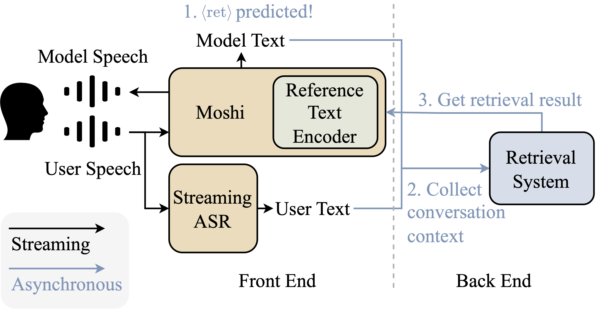
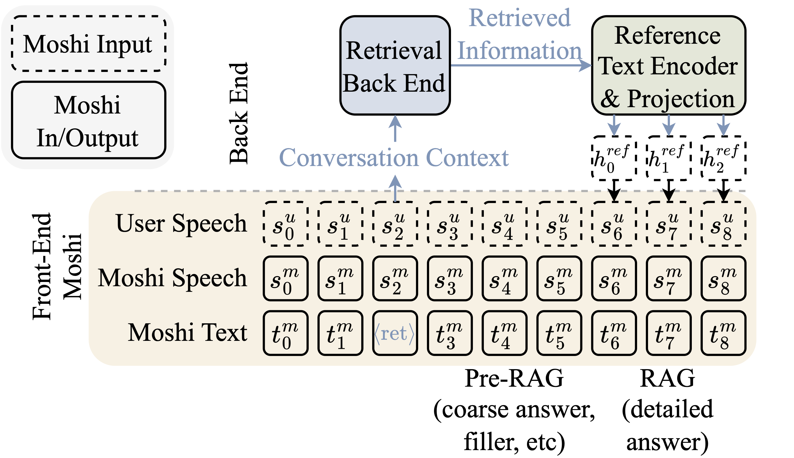

# MoshiRAG: Asynchronous Knowledge Retrieval for Full-Duplex Speech Language Models


[[Read the paper]][moshi-rag] [[Hugging Face]](https://hf.co/collections/kyutai/moshirag-release)

[MoshiRAG][moshi-rag] is a compact **full-duplex** speech language model augmented with asynchronous knowledge retrieval to improve factuality without sacrificing real-time interactivity. Built on top of [Moshi][moshi] and [Mimi][moshi], MoshiRAG predicts when a query needs external knowledge, retrieves references within the natural response delay, and grounds answers in stronger knowledge sources.

This repository is based on the [Moshi repo](https://github.com/kyutai-labs/moshi), augmented with RAG-related implementation.
Please visit the original Moshi repo if you would like to test the original Moshi model.

## Organisation of the repository

This repository includes two main codebases:

- **[PyTorch](#pytorch-implementation)** for research and experimentation, located in [`moshi/`](moshi/).
- **[Rust](#rust-implementation)** for production use, located in [`rust/`](rust/).

Finally, the code for the web UI client is provided in the [`client/`](client/) directory.
 
## System design

MoshiRAG uses a modular front-end/back-end design:
- **Front-end** is a full-duplex speech model based on Moshi that handles real-time conversation.
- **Back end** is an asynchronous retrieval system running in parallel to fetch factual information when needed.

The front end keeps listening and speaking continuously. When the model predicts a retrieval trigger token, conversation context is sent to the retrieval back end while the dialogue continues.  During this period, the model can produce lightweight pre-RAG content (for example, short acknowledgments or coarse responses) so the interaction stays natural.

The back end is text-in/text-out and can be implemented with different retrieval methods (LLM-based retrieval or search-based retrieval, etc).  The retrieval back end takes conversation context (derived by combining the text predicted by Moshi inner monologue and the user transcription predicted by a streaming ASR component) as inputs, and then returns the reference text. Once the retrieval is completed, the reference text is encoded and injected back into Moshi as a stream, allowing later response segments to be grounded in external knowledge without interrupting the ongoing conversation.

<p align="center">
 token. The conversation transcript is sent to the back end which operates asynchronously. Once ready, the result is injected into Moshi which then adapts its response with no interruption."
width="650px"></p>

<p align="center">
</p>


## Models

We release the MoshiRAG model fine-tuned on a female synthetic voice (Moshika). Here is the list of associated HuggingFace repos of the model in different formats.

- MoshiRAG (Moshika) for PyTorch (bf16): [kyutai/moshika-rag-pytorch-bf16](https://huggingface.co/kyutai/moshika-rag-pytorch-bf16), .
- MoshiRAG (Moshika) for Rust/Candle (bf16): [kyutai/moshika-rag-candle-bf16](https://huggingface.co/kyutai/moshika-rag-candle-bf16).

All models are released under the CC-BY 4.0 license.

## Requirements

You will need at least Python 3.10, with 3.12 recommended. For specific requirements, please check the individual backends
directories. You can install the PyTorch and MLX clients with the following:

```bash
pip install -U -e "git+https://git@github.com/kyutai-labs/moshi-rag.git#egg=moshi&subdirectory=moshi"
pip install rustymimi  # mimi, rust implementation with Python bindings from PyPI
```

If you are not using Python 3.12, you might get an error when installing `ruVstymimi`. Then, you will need to install the [Rust toolchain](https://rustup.rs/), or switch to Python 3.12.

While we hope that the present codebase will work on Windows, we do not provide official support for it. At the moment, we do not support quantization for the PyTorch version, so you will need a GPU with a significant amount of memory (24GB) for the front-end Moshi model. The reference encoder can run on a second GPU, or on the **same GPU** as Moshi if you have enough VRAM. The back end can be run either on a local device or a web API can be used. An additional GPU is required if the back end is run locally.

For using the Rust backend, you will need a recent version of the [Rust toolchain](https://rustup.rs/).
To compile GPU support, you will also need the [CUDA](https://developer.nvidia.com/cuda-toolkit) properly installed for your GPU, in particular with `nvcc`.

## PyTorch implementation

The PyTorch based API can be found in the `moshi` directory.

### Back end (retrieval LLM)

It is recommended to run a local OpenAI-compatible LLM with vLLM so retrieval stays low-latency and stable. MoshiRAG is sensitive to retrieval delays over 3 seconds; slower or flaky APIs can hurt response quality.

Example vLLM (served on port `8002`; set `LLM_BASE_URL` to `http://localhost:8002/v1` and `LLM_MODEL_NAME` to `google/gemma-3-27b-it`):

```bash
vllm serve google/gemma-3-27b-it --host 0.0.0.0 --port 8002
```

Alternatively, if you wish to use online APIs, feel free to skip this server but do configurate `LLM_BASE_URL`, `LLM_API_KEY`, and `LLM_MODEL_NAME` properly when running the front end. Choosing low-latency API provider significantly stabilizes MoshiRAG's performance.

### Front end (main Moshi server + reference encoder)

To run MoshiRAG interactively with the web UI, you start two cooperating processes:

1. **Main Moshi server** (`python -m moshi.moshi.server`) — full-duplex speech model. It calls out to a retrieval LLM over HTTP (OpenAI-compatible API) when RAG triggers.
2. **Reference text encoder** (`python -m moshi.moshi.server_conditioner`) — a separate service that encodes retrieved reference strings so they can be injected into Moshi's conditioning path (`REFERENCE_ENCODER_URL` points at this service).

This split keeps the conversational stack modular. The Moshi model and reference encoder can run on the same GPU if you have enough memory, or on separate GPUs (but ideally on the same machine). The main server also streams user audio to an STT (speech-to-text / streaming ASR) endpoint to transcribe user speech into text.

Set the environment variables appropriately before starting the main server (replace placeholders with your keys and endpoints):

| Variable | Role |
| -------- | ---- |
| `REFERENCE_ENCODER_URL` | Base URL of the reference text conditioner (e.g. `http://localhost:8001`). |
| `STT_URL` | Streaming ASR API. We recommend [Gradium](https://gradium.ai/) `wss://eu.api.gradium.ai/api/speech/asr`. Not necessary if `--gradium-stt` is not set and a local STT model will be run instead. |
| `STT_API_KEY` | API key for the STT service of Gradium. Not necessary if `--gradium-stt` is not set and a local STT model will be run instead. |
| `LLM_BASE_URL` | Base URL of the OpenAI-compatible API used for retrieval. We recommend using a local VLLM server. |
| `LLM_API_KEY` | API key for the retrieval LLM. |
| `LLM_MODEL_NAME` | Model id passed to the retrieval API. |
| `MOSHI_RETRIEVAL_LLMS_JSON` | Optional multi-backend retrieval config. When set, it overrides single-backend retrieval selection. |

**1. Start the reference text encoder** (config and checkpoints can be downloaded from [Hugging Face](https://huggingface.co/kyutai/moshika-rag-pytorch-bf16) ):

```bash
python -m moshi.moshi.server_conditioner \
    --config hf://kyutai/moshika-rag-pytorch-bf16/config.json \
    --moshi-weight hf://kyutai/moshika-rag-pytorch-bf16/model.safetensors \
    --cuda-device 0 \
    --conditioner reference_with_time \
    --port 8001
```

**2. Start the main server**:

```bash
export REFERENCE_ENCODER_URL=http://localhost:8001
export STT_URL=wss://eu.api.gradium.ai/api/speech/asr
export STT_API_KEY=YOUR_API_KEY
export LLM_BASE_URL=http://localhost:8002/v1
export LLM_API_KEY=dummy
export LLM_MODEL_NAME=google/gemma-3-27b-it

python -m moshi.moshi.server \
  --gradio-tunnel \
  --static "./client/dist" \
  --init-active-speaker model \
  --gradium-stt
```

You can also configure multiple retrieval backends with `MOSHI_RETRIEVAL_LLMS_JSON`, which overrides single `LLM_BASE_URL`/`LLM_MODEL_NAME` selection for retrieval calls. Example:

```bash
export MOSHI_RETRIEVAL_LLMS_JSON='[{"id": "gpt-oss-20b", "base_url": "https://api.groq.com/openai/v1", "model": "openai/gpt-oss-20b", "prompt_style": "simplified"},  {"id": "gemma-3-27b-it", "base_url": "http://localhost:8002/v1", "model": "google/gemma-3-27b-it", "default": true, "prompt_style": "original"}]'
export LLM_API_KEY=YOUR_API_KEY
export REFERENCE_ENCODER_URL=http://localhost:8001
export STT_URL=wss://eu.api.gradium.ai/api/speech/asr
export STT_API_KEY=YOUR_API_KEY

python -m moshi.moshi.server \
  --gradio-tunnel \
  --static "./client/dist" \
  --init-active-speaker model \
  --gradium-stt
```

- Each array item is one retrieval profile (`id`, `base_url`, `model`, optional `api_key`, optional `prompt_style`).
- `default: true` marks the fallback profile (exactly one required when there are 2+ profiles) which will be used if any retrieval model fails.
- `prompt_style` controls which bundled reference prompt template is used for that profile (`original` or `simplified`; default is `original` for local LLM instances).
- If a profile omits `api_key`, the global `LLM_API_KEY` is used (as in the example).

Run the conditioner, the retrieval LLM (when local), and the main server on the same machine when you can, to reduce networking issues and simplify debugging.

### Web UI

Access the web UI on [localhost:8998](http://localhost:8998).
If your GPU is on a distant machine this will not work because for security reasons, websites using HTTP
are not allowed to use the microphone. There are two ways to get around this:
- Forward the remote 8998 port to your localhost using ssh `-L` flag. Then
  connects to [localhost:8998](http://localhost:8998) as mentioned previously.
- Use the `--gradio-tunnel` argument, setting up a tunnel with a URL accessible from anywhere.
  Keep in mind that this tunnel goes through the US and can add significant
  latency (up to 500ms from Europe). You can use `--gradio-tunnel-token` to set a
  fixed secret token and reuse the same address over time.

Accessing a server that is not localhost via http may cause issues with using
the microphone in the web UI (in some browsers this is only allowed using
https).

### Inference script

We also provide an inference script which runs the PyTorch MoshiRAG pipeline on a folder of WAV audio files, and writes output WAVs and JSON logs to the specified destination. Set up `LLM_BASE_URL`, `LLM_API_KEY`, and `LLM_MODEL_NAME` as previously mentioned for MoshiRAG to obtain reference text.

```bash
export REFERENCE_ENCODER_URL=http://localhost:8001
export LLM_BASE_URL=http://localhost:8002/v1
export LLM_API_KEY=dummy
export LLM_MODEL_NAME=google/gemma-3-27b-it

python -m moshi.moshi.run_inference \
  --input-dir INPUT_DIR \
  --output-dir OUTPUT_DIR \
  --max-consecutive-silence-frames 40
```


## Rust implementation

In order to run the Rust inference server, set up environment variables `LLM_BASE_URL`, `LLM_API_KEY`, and `LLM_MODEL_NAME`, and use the following command from within the `rust` directory:

```bash
export LLM_BASE_URL=http://localhost:8002/v1
export LLM_API_KEY=dummy
export LLM_MODEL_NAME=google/gemma-3-27b-it

cargo run --features cuda --bin moshi-backend -r -- --config moshi-backend/config.json standalone
```

When using macOS, you can replace `--features cuda` with `--features metal`.
Refer to `rust/README.md` for more details regarding the config.

Once the server has printed 'standalone worker listening', you can use the web
UI. By default the Rust server uses https so it will be at
[localhost:8998](https://localhost:8998).

You will get warnings about the site being unsafe. When using chrome you
can bypass these by selecting "Details" or "Advanced", then "Visit this unsafe
site" or "Proceed to localhost (unsafe)."

## License

The present code is provided under the MIT license for the Python parts, and Apache license for the Rust backend.
The web client code is provided under the MIT license.
Note that parts of this code is based on [AudioCraft](https://github.com/facebookresearch/audiocraft), released under
the MIT license.

The weights for the models are released under the CC-BY 4.0 license.

## Citation

Please cite the following paper if you find this implementation useful.

```
@misc{chien2026moshirag,
      title={MoshiRAG: Asynchronous Knowledge Retrieval for Full-Duplex Speech Language Models}, 
      author={Chung-Ming Chien and Manu Orsini and Eugene Kharitonov and Neil Zeghidour and Karen Livescu and Alexandre D{\'e}fossez},
      year={2026},
      eprint={2604.12928},
      archivePrefix={arXiv},
      primaryClass={cs.CL},
      url={https://arxiv.org/abs/2604.12928}, 
}
```

[moshi]: https://arxiv.org/abs/2410.00037
[moshi-rag]: https://arxiv.org/abs/2604.12928